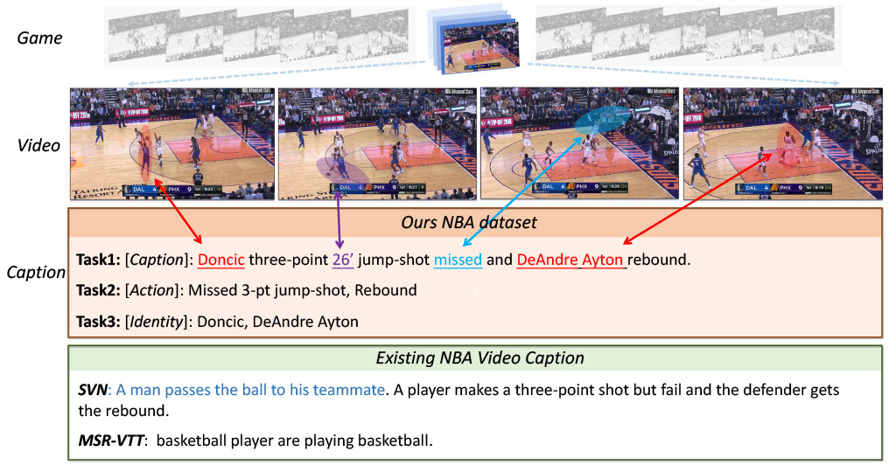

# Sports Video Analysis on Large-Scale Data （Accepted by ECCV2022）

*[Dekun Wu](https://jackwu502.github.io/)*<sup>1*</sup>, 
*[He Zhao](https://joehezhao.github.io/)*<sup>2*</sup>, 
*Xingce Bao*<sup>3</sup>, 
*[Richard P. Wildes](http://www.cse.yorku.ca/~wildes/)*<sup>2</sup>, 

<sup>1</sup>University of Pittsburgh &nbsp;&nbsp;
<sup>2</sup>York University &nbsp;&nbsp; 
<sup>3</sup>EPFL &nbsp;&nbsp; 

<span>*</span> Equal Contribution
<div align="center">
</img>
</div>

**Abstract**: This paper investigates the  modeling of automated machine description on sports video, which has seen much progress recently. Nevertheless, state-of-the-art approaches fall quite short of capturing how human experts analyze sports scenes. In this paper, we propose a novel large-scale NBA dataset for Sports Video Analysis (NSVA) with a focus on captioning, to address the above challenges. We also design a unified approach to process raw videos into a stack of meaningful features with minimum labelling efforts, showing that cross modeling on such features using a transformer architecture leads to strong performance. In addition, we demonstrate the broad application of NSVA by addressing two additional tasks, namely fine-grained sports action recognition and salient player identification.

## Algorithm outline
<div align="center">
</img>
</div>

**Approach**: Our approach relies on feature representations extracted from multiple orthogonal perspectives, we adopt the framework of UniVL [1], a network designed for cross feature interactive modeling, as our base model. It consists of four transformer backbones that are responsible for coarse feature encoding (using TimeSformer [2]), fine-grained feature encoding (e.g., basket, ball, players), cross attention and decoding, respectively. 

## Code Overview
The following sections contain scripts or PyTorch code for:

- A. Download pre-processed NSVA dataset.
- B. Training/evaluation script: (1) video captioning, (2) action recognition and (3) player identification.
- C. Pre-trained weigths.

## Install Dependencies
* python==3.6.9
* torch==1.7.0+cu92
* tqdm
* boto3
* requests
* pandas
* nlg-eval (Install Java 1.8.0 (or higher) firstly)

```
conda create -n sportsformer python=3.6.9 tqdm boto3 requests pandas
conda activate sportsformer
pip install torch==1.7.1+cu92
pip install git+https://github.com/Maluuba/nlg-eval.git@master
```
This code assumes CUDA support.

## Prepare the Dataset 
Information about dataset preparation can be found at this [link](https://github.com/jackwu502/NSVA/tree/main/SportsFormer/data).

## Video captioning
Run the following code for training/evaluating from scratch video description captioning
```
cd SportsFormer
python -m torch.distributed.launch --nproc_per_node 4 main_task_caption.py --do_train --num_thread_reader 0 --epochs 20 --batch_size 48 --n_display 300 --train_csv data/ourds_train.44k.csv --val_csv data/ourds_JSFUSION_test.csv --data_path data/ourds_description_only.json --features_path data/ourds_videos_features.pickle --bbx_features_path data/cls2_ball_basket_sum_concat_original_courtline_fea.pickle --output_dir ckpt_ourds_caption --bert_model bert-base-uncased --do_lower_case --lr 3e-5 --max_words 30 --max_frames 30 --batch_size_val 1 --visual_num_hidden_layers 6 --decoder_num_hidden_layer 3 --cross_num_hidden_layers 3 --datatype ourds --stage_two --video_dim 768 --init_model weight/univl.pretrained.bin --train_tasks 0,0,1,0 --test_tasks 0,0,1,0

```

Or evalute with our pre-trained model at **weights** folder:
```
python -m torch.distributed.launch --nproc_per_node 4 main_task_caption.py --do_eval --num_thread_reader 0 --epochs 20 --batch_size 48 --n_display 300 --train_csv data/ourds_train.44k.csv --val_csv data/ourds_JSFUSION_test.csv --data_path data/ourds_description_only.json --features_path data/ourds_videos_features.pickle --bbx_features_path data/cls2_ball_basket_sum_concat_original_courtline_fea.pickle --output_dir ckpt_ourds_caption --bert_model bert-base-uncased --do_lower_case --lr 3e-5 --max_words 30 --max_frames 30 --batch_size_val 1 --visual_num_hidden_layers 6 --decoder_num_hidden_layer 3 --cross_num_hidden_layers 3 --datatype ourds --stage_two --video_dim 768 --init_model weight/best_model_vcap.bin --train_tasks 0,0,1,0 --test_tasks 0,0,1,0

```

**Results** reproduced from [pre-trained model](https://www.dropbox.com/s/tq1hffo4ju2nd0o/best_model_vcap.bin) 

| **Description Captioning**  | **C**  | **M** | **B@1** | **B@2** | **B@3** | **B@4** | **R_L** |
| -----------------------------| ------- | -------- |----------| ----------| ----------| ----------| ----------|
| **Our full model** | **1.1329**   | **0.2420**    | **0.5219**    | **0.4080**    |**0.3120**    |**0.2425**    |**0.5101** |

## Action recognition
Run the following code for training/evaluating from scratch video description captioning
```
cd SportsFormer
env CUDA_VISIBLE_DEVICES=0 python -m torch.distributed.launch --nproc_per_node=1 ./main_task_action_multifeat_multilevel.py
```

**Results** reproduced from pre-trained model 

| **Action Recognition**  | **SuccessRate**  | **mAcc.** | **mIoU** |
| -----------------------------| ------- | -------- |----------| 
| **Our full model Coarse** | **60.14**   | **61.20**    | **76.61**    |
| **Our full model Fine** | **46.88**   | **51.25**    | **57.08**    |
| **Our full model Event** | **37.67**   | **42.34**    | **46.45**    |

## Player identification
Run the following code for training/evaluating from scratch video description captioning
```
cd SportsFormer
env CUDA_VISIBLE_DEVICES=0 python -m torch.distributed.launch --nproc_per_node=1 ./main_task_player_multifeat.py
```

**Results** reproduced from pre-trained model 

| **Play Identification**  | **SuccessRate**  | **mAcc.** | **mIoU** |
| -----------------------------| ------- | -------- |----------|
| **Our full model** | **4.63**   | **6.97**    | **6.86**    | 


## Video downloading tools
If you would like to download the raw mp4 videos that we use for our dataset, you can use the following code
```
cd tools
python collect_videos.py
```
If you want to download other videos from NBA.com, you can use the following code

```
cd tools
python download_video_by_gameid_eventid_date.py
```

## Citation

If you find this code useful in your work then please cite

```bibtex
@inproceedings{dew2022sports,
  title={Sports Video Analysis on Large-Scale Data},
  author={Wu, Dekun and Zhao, He and Bao, Xingce and Wildes, Richard P.},
  booktitle={ECCV},
  month = {Oct.},
  year={2022}
}
```

## Acknowledgement
This code base is largely from [UniVL](https://github.com/microsoft/UniVL). Many thanks to the authors.

## License

The majority of this work which includes code and data is licensed under [Creative Commons Attribution-NonCommercial (CC-BY-NC) license](http://creativecommons.org/licenses/by-nc/4.0/). However part of the project is available under a separate license term: [UniVL](https://github.com/microsoft/UniVL) is licensed under the [MIT license](https://github.com/microsoft/UniVL/blob/main/LICENSE).

## Contact
Please contact Dekun Wu @ dew104@pitt.edu or He Zhao @ zhufl@eecs.yorku.ca, if any issue.

## References
[1] H. Luo et al. "UniVL: A Unified Video and Language Pre-Training Model for Multimodal Understanding and Generation
" Arxiv'2020.

[2] G Bertasiuset al. "Is space-time attention all you need for video understanding?." ICML'2021
